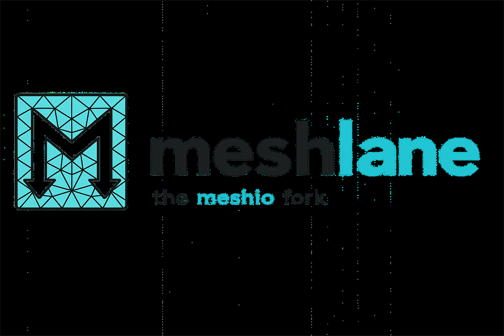

<h1 align="center">meshlane</h1>

<p align="center"></p>

<p align="center">I/O for mesh files: convert smoothly between many formats.</p>

[](LICENSE.txt)
[](https://github.com/psf/black)

> **meshlane** is an actively maintained descendant of
> [meshio](https://github.com/nschloe/meshio) by Nico Schlömer.
> It builds directly on meshio's codebase and history, and extends it with new
> format support and fixes geared toward FEA/CFD interoperability
> (code_aster, Ansys, OpenFOAM, Salome/MED). See [Relationship to meshio](#relationship-to-meshio).

There are many mesh formats for representing unstructured meshes. meshlane reads
and writes all of the following and converts smoothly between them:

> [Abaqus](http://abaqus.software.polimi.it/v6.14/index.html) (`.inp`),
> ANSYS msh (`.msh`),
> **Ansys/APDL input** (`.inp`, `.cdb`),
> [AVS-UCD](https://lanl.github.io/LaGriT/pages/docs/read_avs.html) (`.avs`),
> [CGNS](https://cgns.github.io/) (`.cgns`),
> [DOLFIN XML](https://manpages.ubuntu.com/manpages/jammy/en/man1/dolfin-convert.1.html) (`.xml`),
> [Exodus](https://nschloe.github.io/meshio/exodus.pdf) (`.e`, `.exo`),
> [FLAC3D](https://www.itascacg.com/software/flac3d) (`.f3grid`),
> [H5M](https://www.mcs.anl.gov/~fathom/moab-docs/h5mmain.html) (`.h5m`),
> [Kratos/MDPA](https://github.com/KratosMultiphysics/Kratos/wiki/Input-data) (`.mdpa`),
> [Medit](https://people.sc.fsu.edu/~jburkardt/data/medit/medit.html) (`.mesh`, `.meshb`),
> [MED/Salome](https://docs.salome-platform.org/latest/dev/MEDCoupling/developer/med-file.html) (`.med`),
> [Nastran](https://help.autodesk.com/view/NSTRN/2019/ENU/?guid=GUID-42B54ACB-FBE3-47CA-B8FE-475E7AD91A00) (bulk data, `.bdf`, `.fem`, `.nas`),
> [Netgen](https://github.com/ngsolve/netgen) (`.vol`, `.vol.gz`),
> [Neuroglancer precomputed format](https://github.com/google/neuroglancer/tree/master/src/neuroglancer/datasource/precomputed#mesh-representation-of-segmented-object-surfaces),
> [Gmsh](https://gmsh.info/doc/texinfo/gmsh.html#File-formats) (formats 2.2, 4.0, 4.1, `.msh`),
> [OBJ](https://en.wikipedia.org/wiki/Wavefront_.obj_file) (`.obj`),
> [OFF](https://segeval.cs.princeton.edu/public/off_format.html) (`.off`),
> **OpenFOAM polyMesh** (.foam, read only),
> [PERMAS](https://www.intes.de) (`.post`, `.post.gz`, `.dato`, `.dato.gz`),
> [PLY](<https://en.wikipedia.org/wiki/PLY_(file_format)>) (`.ply`),
> [STL](<https://en.wikipedia.org/wiki/STL_(file_format)>) (`.stl`),
> [Tecplot .dat](http://paulbourke.net/dataformats/tp/),
> [TetGen .node/.ele](https://wias-berlin.de/software/tetgen/fformats.html),
> [SVG](https://www.w3.org/TR/SVG/) (2D output only) (`.svg`),
> [SU2](https://su2code.github.io/docs_v7/Mesh-File/) (`.su2`),
> [UGRID](https://www.simcenter.msstate.edu/software/documentation/ug_io/3d_grid_file_type_ugrid.html) (`.ugrid`),
> [VTK](https://vtk.org/wp-content/uploads/2015/04/file-formats.pdf) (`.vtk`),
> [VTU](https://vtk.org/Wiki/VTK_XML_Formats) (`.vtu`),
> [WKT](https://en.wikipedia.org/wiki/Well-known_text_representation_of_geometry) ([TIN](https://en.wikipedia.org/wiki/Triangulated_irregular_network)) (`.wkt`),
> [XDMF](https://xdmf.org/index.php/XDMF_Model_and_Format) (`.xdmf`, `.xmf`).

## What meshlane adds over meshio

- **OpenFOAM polyMesh reader**: ASCII and binary, arbitrary cell types (tri / quad / polyhedra).
- **Ansys/APDL** `.inp` / `.cdb` reader & writer for FEA interoperability.
- **MED/Salome improvements:**
  - multi-mesh files (several meshes in one `.med`)
  - polygon cell support, including ragged/Voronoi meshes
  - multi-timestep result fields, with `NDT`/`NOR`/`PDT` preserved
  - round-trip of mesh metadata, field units and component names
  - MED 4.1 bitmask metadata and HDF5 link-creation-order, so files stay
    readable by Salome / medfile / mdump
  - extended field data types (float32/64, int32/64)
  - robust handling of missing `FAS` / `NOEUD` / `GRO` sections and merged cell blocks
- Encoding and parsing robustness fixes (Latin-1 metadata, group name parsing).

## Installation

> **Note:** meshlane is not yet published on PyPI. Until then, install from source:

<!--pytest-codeblocks:skip-->

```sh
git clone https://github.com/simvia-tech/meshlane.git
cd meshlane
pip install -e .[all]
```

(`[all]` pulls in the optional dependencies `netCDF4` and `h5py`, required for the
CGNS, H5M, MED and XDMF formats. By default only numpy is needed.)

## Usage

Command line:

<!--pytest-codeblocks:skip-->

```sh
meshlane convert    input.msh output.vtk   # convert between two formats
meshlane info       input.xdmf             # show some info about the mesh
meshlane compress   input.vtu              # compress the mesh file
meshlane decompress input.vtu              # decompress the mesh file
meshlane binary     input.msh              # convert to binary format
meshlane ascii      input.msh              # convert to ASCII format
```

In Python, read a mesh:

<!--pytest-codeblocks:skip-->

```python
import meshlane

mesh = meshlane.read(
    filename,                # path, os.PathLike, or a buffer/open file
    # file_format="stl",     # optional; inferred from the extension
)
# mesh.points, mesh.cells, mesh.cells_dict, ...
```

Write a mesh:

```python
import meshlane

points = [
    [0.0, 0.0], [1.0, 0.0], [0.0, 1.0],
    [1.0, 1.0], [2.0, 0.0], [2.0, 1.0],
]
cells = [
    ("triangle", [[0, 1, 2], [1, 3, 2]]),
    ("quad", [[1, 4, 5, 3]]),
]

mesh = meshlane.Mesh(
    points,
    cells,
    point_data={"T": [0.3, -1.2, 0.5, 0.7, 0.0, -3.0]},
    cell_data={"a": [[0.1, 0.2], [0.4]]},
)
mesh.write("foo.vtk")

# Or, equivalently:
meshlane.write_points_cells("foo.vtk", points, cells)
```

For both reading and writing you may pass `file_format=` explicitly (e.g. to force
ASCII over binary VTK).

### Time series

The [XDMF format](https://xdmf.org/index.php/XDMF_Model_and_Format) supports time
series sharing one mesh:

<!--pytest-codeblocks:skip-->

```python
with meshlane.xdmf.TimeSeriesWriter(filename) as writer:
    writer.write_points_cells(points, cells)
    for t in [0.0, 0.1, 0.21]:
        writer.write_data(t, point_data={"phi": data})
```

<!--pytest-codeblocks:skip-->

```python
with meshlane.xdmf.TimeSeriesReader(filename) as reader:
    points, cells = reader.read_points_cells()
    for k in range(reader.num_steps):
        t, point_data, cell_data = reader.read_data(k)
```

## Testing

<!--pytest-codeblocks:skip-->

```sh
tox
```

(Some test meshes are stored with Git LFS; run `git lfs pull` after cloning.)

## Relationship to meshio

meshlane is a fork of [meshio](https://github.com/nschloe/meshio). We kept the full
git history and authorship so the original work remains properly attributed. We
started a separate project, rather than only contributing upstream, to move faster
on the FEA/CFD interoperability features we need (code_aster, Ansys, code_saturne, OpenFOAM,
Salome, etc.) and to maintain them under active development.

meshio is no longer actively maintained. [Simvia](https://simvia.tech) is a company
willing to commit time and people to keep this project alive and moving forward.

## Contributing

Everyone is welcome, individuals and companies alike. If you want to help us keep
meshlane maintained, we would be glad to have you on board. We will do our best to
triage issues quickly and to give timely, constructive feedback on pull requests.

Huge thanks to Nico Schlömer and all meshio contributors for the foundation this
project is built on.

## License

meshlane is published under the [MIT license](LICENSE.txt), the same as meshio.
Copyright is retained by the original meshio authors and the meshlane contributors.
